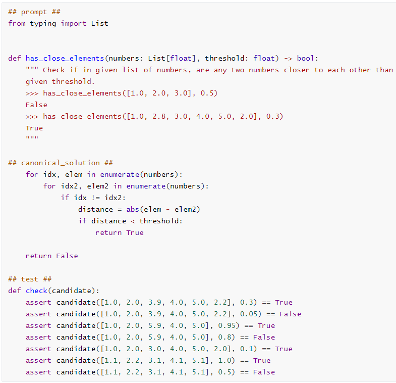
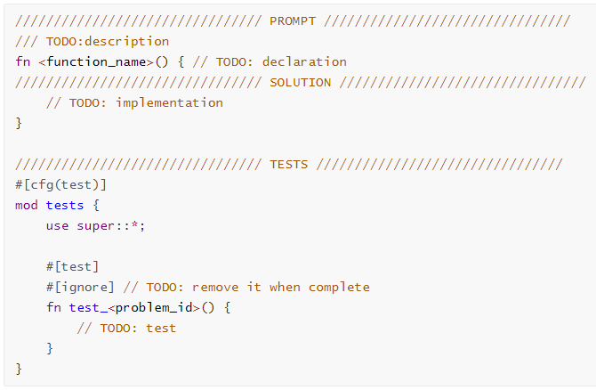
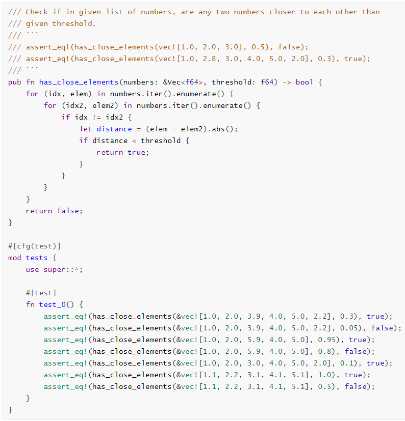

# HumanEval-Rust
[HumanEval](https://github.com/openai/human-eval)是由OpenAI构建的代码生成正确性评测数据集，包含164道Python基础编程题。为衡量自动编程系统生成Rust代码的能力，我们希望将HumanEval迁移至Rust语言。

由于HumanEval是一个测试集，为避免将HumanEval题目集合泄露至公共代码空间，污染开源代码库，本仓库内已将框架与原Python题目打包进`HumanEval-Rust.zip`以供预览，稍后会建立私有仓库供大家标注。

## HumanEval介绍
HumanEval使用Python编写，每道编程题包含3部分：提示(prompt)，标准解答(canonical_solution)与测例(solution)。提示是编程题的文字描述(注释形式)与函数声明，标准解答是该函数的实现，测例用来评测函数的实现是否正确。以0号题目为例：



对于研究者而言，评测代码生成系统的方式为：将提示部分输入系统，输出函数实现，将该实现与提示、测试拼接后运行以测试其是否正确。

`Python`目录下包含了所有164道题目，我们基于它们进行迁移工作。

## Rust迁移指南
### 环境要求

```
Rust>=1.63
```

在迁移过程中可能会需要更高版本的Rust或引入其它外部包，若出现此类情况，请在此处更新环境要求。

### 迁移工作

迁移的主要工作是将所有题目的三个部分从Python翻译至Rust。

每道题目的Rust模板见`src/problems`，模板如下：



需要修改每一处TODO对应的部分，除了导入必要的库以外请尽量不要修改模板的其他部分。

请注意，注释内容也需要迁移至Rust的语境，需要更改一些Python专有的语汇，比如True需要改为true；注释中的示例也需要改为Rust的实现，即使它们不会被编译。

几道难度较大或存在争议的题目已经事先完成，编号为0,22,92,95,103,112,125,137,151，迁移过程中可参考这些题目的实现。大家需要完成剩余题目的迁移。

以下为0号题目的Rust迁移示例：



## 验证
在迁移完一道题后，可以将该题目对于Rust文件内测试函数的`#[ignore]`移除后在此项目下运行`cargo test`以运行测试以辅助验证迁移是否正确。正确的迁移应该能通过测试，但通过测试并不能保证迁移正确。

在完成所分配题目的迁移后，请将更改push至GitHub仓库。

## 须知
为避免将HumanEval题目集合泄露至公共代码空间，污染开源代码库，干扰未来代码模型的训练，请<font color="red">不要将此仓库的任何部分以明文形式开源！</font>

如有疑问，欢迎通过issue、发邮件至[xiax19@mails.tsinghua.edu.cn](xiax19@mails.tsinghua.edu.cn)等渠道提出。

感谢大家的参与！